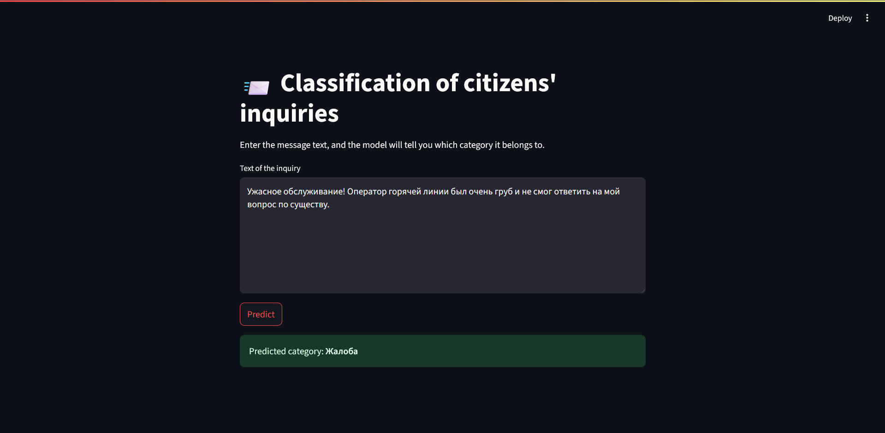

# Citizen Inquiry Classification (✿◡‿◡)

## Overview

This project was developed during an internship at the State Corporation **"Government for Citizens"**. Its objective is to automate the **categorization of incoming citizen inquiries** using Natural Language Processing and Machine Learning. Accurate classification improves routing to relevant departments, reduces delays, and increases citizen satisfaction.

---

## Dataset

The dataset consists of **textual inquiries** with corresponding manually labeled categories, such as:

- Payments  
- Registration  
- Complaints  
- Suggestions  
- Service Requests

A **sample subset** (`sample_data/sample_inquiries.csv`) is included for demonstration. The full dataset is confidential and not shared publicly.

---

## Technologies Used

- **Python 3.12**
- **Jupyter Notebook**
- **Libraries:**
  - `pandas`, `numpy`
  - `scikit-learn`, `joblib`
  - `matplotlib`, `seaborn`
  - `nltk`, `natasha` (for Russian text lemmatization)
  - `streamlit`

---

## Setup Instructions

1. **Clone the repository**  
```bash
git clone https://github.com/khussainovaD/citizen_inquiry_classification.git
cd citizen_inquiry_classification
```

2. **Create and activate a virtual environment (optional but recommended)**

```bash
python -m venv venv # Windows venv\Scripts\activate # Linux/macOS source venv/bin/activate
```

3. **Install dependencies**
```bash
pip install -r requirements.txt
```

4. **Download additional NLTK data (if needed)**
```bash
import nltk 
nltk.download('punkt') 
nltk.download('stopwords') 
nltk.download('wordnet') 
nltk.download('omw-1.4')
```
___

## Usage

### Notebook Workflow

1. Launch Jupyter:
```
jupyter notebook
```

2. Follow the notebooks in order:
    - `01_Data_Loading_and_EDA.ipynb`
    - `02_Text_Preprocessing.ipynb`
    - `03_Model_Training_and_Evaluation.ipynb`

3. Streamlit App
```bash
streamlit run app.py
```

___
## Results

- Used classifiers: **Naive Bayes**, **Logistic Regression**, **SVM**
- Evaluation metrics:
    - Accuracy
    - Precision / Recall / F1-score
    - Confusion Matrix

Best results were achieved with **Logistic Regression**, which showed reliable performance across multiple categories after hyperparameter tuning.

Paste the inquiry text and select **"Predict"** to get a category prediction.
1. INPUT

2. RESULT

___
## Tests

To ensure the robustness of the data pipeline and model performance, several unit tests have been implemented using `pytest`. These tests verify key aspects such as:

- Correct loading of sample data (`test_data_loading.py`)
- Integrity and consistency of text preprocessing, including lemmatization (`test_text_preprocessing.py`)
- Valid predictions and output structure from the trained classifier (`test_model_prediction.py`)

### Running Tests

1. Navigate to the project root.
2. Run the test suite with:

    ```bash
    pytest tests/
    ```


> All tests are located inside the `tests/` folder and are designed to be minimal yet meaningful checks for each pipeline stage.

**Note:** Natasha-based preprocessing tests require Russian morphological components, which are automatically loaded during preprocessing. Ensure an internet connection is available for initial downloads.


___
## 👩‍💻 Author

**Dariya Khussainova**  
_Machine Learning Intern at State Corporation "Government for Citizens"_  
**Date:** 30 June 2025

